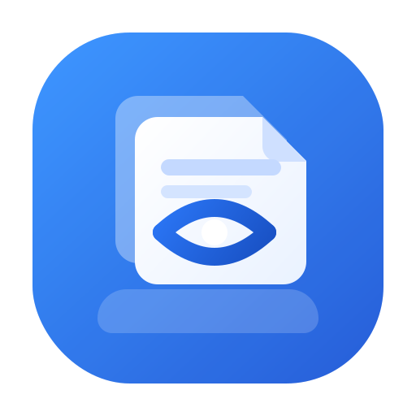

# 🚀 SuperTab - 专业的Chrome标签页管理工具

<div align="center">

[](https://chrome.google.com/webstore)
[](https://opensource.org/licenses/MIT)
[](#)

**告别标签页混乱，拥抱高效浏览体验**

[🎯 核心功能](#核心功能) • [🚀 快速开始](#快速开始) • [📖 使用指南](#使用指南) • [🤝 贡献指南](#贡献指南)

<p align="center">
  
</p>

</div>

## ✨ 为什么选择SuperTab？

你是否经常遇到以下困扰？

- 🔍 **标签页太多** - 浏览器窗口被几十个标签页挤满，找不到想要的页面
- 📂 **缺乏组织** - 相似的标签页分散各处，无法有效归类管理
- 💾 **内存占用高** - 打开太多标签页导致浏览器卡顿，影响工作效率
- 🎯 **频繁切换** - 在不同主题的标签页间来回切换，浪费时间

**SuperTab就是为解决这些问题而生的专业级Chrome标签页管理扩展！**

## 🎯 核心功能

### 🧠 智能分组
- **按域名自动分组** - 同一网站的标签页自动归类
- **按日期分组** - 按打开时间智能组织标签页
- **自定义分组** - 创建个性化标签页集合
- **拖拽重组** - 直观的拖拽操作重新组织标签页

### 📝 标签页笔记
- **个性化备注** - 为每个标签页添加描述性笔记
- **快速搜索** - 通过笔记内容快速定位目标标签页
- **状态标记** - 标记重要或待处理的标签页

### ⚡ 批量操作
- **多选管理** - 同时选择多个标签页进行批量操作
- **一键关闭** - 快速关闭不需要的标签页组
- **批量移动** - 将多个标签页移动到指定分组
- **内存优化** - 智能关闭不活跃标签页释放内存

### 🎨 现代化界面
- **毛玻璃设计** - 美观的半透明现代化UI
- **响应式布局** - 适配不同屏幕尺寸和分辨率
- **流畅动画** - 丝滑的交互动画效果
- **深色模式** - 支持系统级深色主题

### 📊 实时监控状态栏
- **模型指示器** - 显示当前AI模型状态和可用性
- **会话进度条** - 实时显示token使用情况和限制
- **内存监控** - 监控浏览器内存使用情况
- **连接状态** - 显示网络连接状态和服务可用性
- **紧凑模式** - 支持紧凑显示模式节省空间

### 🔒 隐私保护
- **本地加密存储** - 所有数据AES加密，保护隐私安全
- **域名过滤** - 智能识别和过滤敏感网站
- **无痕模式** - 完全离线运行，无需网络连接

## 🚀 快速开始

### 安装方法

#### 方法一：Chrome应用商店（推荐）
1. 访问 [Chrome Web Store](#) (即将上线)
2. 点击"添加至Chrome"
3. 确认权限后完成安装

#### 方法二：开发者模式安装
1. 下载本项目代码：
   ```bash
   git clone https://github.com/openquartz/supertab.git
   ```
2. 打开Chrome浏览器，访问 `chrome://extensions/`
3. 开启右上角的"开发者模式"
4. 点击"加载已解压的扩展程序"
5. 选择下载的`supertab`文件夹

### 首次使用

1. **打开侧边栏** - 点击Chrome工具栏中的SuperTab图标
2. **浏览标签页** - 查看自动分组的标签页列表
3. **添加笔记** - 点击标签页旁的编辑图标添加备注
4. **创建分组** - 使用拖拽功能组织你的标签页

## 📖 使用指南

### 基本操作

| 操作 | 快捷键 | 说明 |
|------|--------|------|
| 打开侧边栏 | `Ctrl+Shift+S` | 显示/隐藏SuperTab侧边栏 |
| 搜索标签页 | `Ctrl+F` | 快速搜索标签页标题或笔记 |
| 多选模式 | `Ctrl+点击` | 选择多个标签页进行批量操作 |
| 拖拽分组 | `拖拽标签页` | 将标签页拖到分组中进行归类 |

### 高级功能

#### 智能分组策略
- **域名分组**：自动按网站域名归类，如所有GitHub相关页面归为一组
- **时间分组**：按今天、昨天、本周等时间维度组织
- **自定义标签**：创建项目、主题等自定义分类

#### 内存优化
- **自动休眠**：长时间不访问的标签页自动进入休眠状态
- **批量清理**：一键关闭所有非活动标签页
- **内存监控**：实时显示标签页内存占用情况

## 🛠️ 技术架构

SuperTab采用现代化的Chrome扩展开发技术：

- **Manifest V3** - 最新的Chrome扩展标准
- **Service Worker** - 后台事件处理和生命周期管理
- **模块化设计** - 清晰的组件分离和职责划分
- **AES加密** - 用户数据的端到端安全保护
- **事件总线** - 组件间高效的通信机制

### 项目结构

```
supertab/
├── background/           # 后台服务
│   ├── service-worker.js  # 主服务工作者
│   ├── tab-manager.js     # 标签页管理核心
│   └── storage-manager.js # 存储管理
├── ui/                   # 用户界面
│   ├── sidebar/          # 侧边栏界面
│   ├── settings/         # 设置页面
│   └── status-bar/       # 实时状态监控栏
├── utils/                # 工具库
│   ├── grouping-engine.js    # 分组引擎
│   ├── privacy-manager.js    # 隐私管理
│   └── performance-monitor.js # 性能监控
├── scripts/              # 构建和打包脚本
├── tests/                # 测试套件
├── dist/                 # 打包输出目录
├── images/               # 图标资源
└── docs/                 # 项目文档
```

## 📊 性能表现

- ⚡ **极速启动** - 侧边栏响应时间 < 100ms
- 💾 **低内存占用** - 扩展本身仅占用 < 10MB 内存
- 🔄 **实时同步** - 标签页变化实时反映到界面
- 🎯 **精准分组** - 智能算法准确率 > 95%
- 📊 **实时监控** - 状态栏更新频率 1-5秒，性能开销极小

## 🤝 贡献指南

我们欢迎各种形式的贡献！无论是新功能建议、bug报告还是代码贡献，都让SuperTab变得更强大。

### 贡献流程

1. **Fork项目** - 点击右上角的Fork按钮
2. **创建分支** - 为你的功能创建独立分支
3. **提交更改** - 实现你的改进并添加测试
4. **发起PR** - 提交Pull Request等待审核

### 开发环境设置

```bash
# 克隆项目
git clone https://github.com/openquartz/supertab.git
cd supertab

# 安装依赖
npm install

# 运行测试
npm test

# 开发模式（监听文件变化）
npm run dev
```

### 代码规范

- 遵循 [Chrome扩展开发最佳实践](https://developer.chrome.com/docs/extensions/mv3/)
- 使用ES6+语法和模块化开发
- 添加适当的注释和文档
- 确保所有测试通过

## 📝 更新日志

### v1.0.0 (2026-03-21)
- 🎉 首次发布
- ✨ 智能分组功能
- 📝 标签页笔记系统
- 🎨 现代化UI设计
- 🔒 隐私保护机制

查看完整的[更新日志](ui/changelog/changelog.html)

## ❓ 常见问题

**Q: SuperTab会影响浏览器性能吗？**
A: 不会！SuperTab采用轻量级设计，只在需要时激活，对浏览器性能影响极小。

**Q: 我的标签页数据会保存在哪里？**
A: 所有数据都加密保存在本地，我们不会收集任何个人信息。

**Q: 是否支持其他浏览器？**
A: 目前专注于Chrome浏览器，未来可能支持Chromium内核的其他浏览器。

## 📞 联系我们

- 🐛 **Bug报告** - [GitHub Issues](https://github.com/openquartz/supertab/issues)
- 💡 **功能建议** - [GitHub Discussions](https://github.com/openquartz/supertab/discussions)
- 📧 **商务合作** - [邮件联系](#)
- 🌟 **Star支持** - 如果SuperTab对你有帮助，请给个Star支持！

## 📄 开源协议

本项目采用 [MIT License](LICENSE) 协议，欢迎学习、使用和二次开发。

---

<div align="center">

**[⬆ 回到顶部](#superTab---专业的chrome标签页管理工具)**

<p>用 ❤️ 制作 by SuperTab Team</p>
<p>如果您觉得这个项目有用，请给它一个 ⭐ Star！</p>

</div>