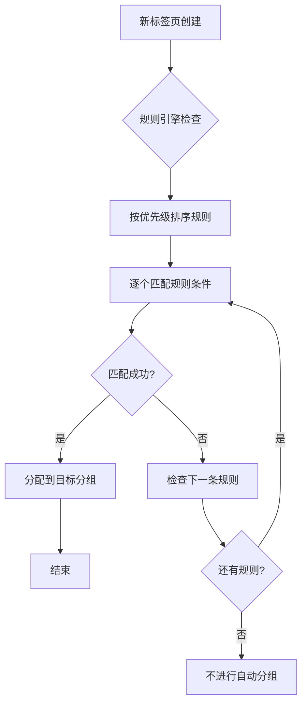

# 智能分组功能设计方案

## 背景
基于TabFlow现有的自定义分组功能，需要设计一个智能分组规则系统，让用户可以设置自定义规则，自动根据规则进行匹配并将标签页路由到相应的分组中。参考邮箱规则设置的设计理念，保持简单易用、通俗易懂的原则。

## 现有功能分析
- 已有基础的自定义分组功能（createCustomGroup）
- 已存在分组引擎（GroupingEngine）支持多种分组策略
- 已有分组UI组件和交互逻辑
- 支持域名分组、时间分组、内容相似性分组等

## 需求确认

基于用户反馈，确定以下需求：

1. **规则匹配条件**：简单关键词匹配（适合普通用户）
2. **规则触发时机**：新标签页创建时应用规则
3. **规则管理功能**：启用/禁用规则、规则优先级、基础管理（添加、删除、编辑）

## 设计方案：智能分组规则系统

### 核心架构

#### 1. 规则引擎设计
```javascript
// 规则数据结构
interface GroupingRule {
  id: string;           // 规则ID
  name: string;         // 规则名称
  enabled: boolean;     // 启用状态
  priority: number;     // 优先级（数字越小优先级越高）
  conditions: {
    field: 'title' | 'url' | 'domain';  // 匹配字段
    keyword: string;     // 关键词
    caseSensitive: boolean;  // 是否区分大小写
  }[];
  targetGroup: {
    name: string;        // 目标分组名称
    autoCreate: boolean; // 自动创建分组
  };
  createdAt: number;    // 创建时间
}
```

#### 2. 系统组件

**RuleEngine（规则引擎）**
- 规则的存储和管理
- 规则的匹配和执行
- 冲突检测和优先级处理

**RuleManager（规则管理器）**
- 规则的CRUD操作
- 规则启用/禁用切换
- 规则优先级调整

**AutoGrouper（自动分组器）**
- 监听新标签页事件
- 应用规则进行自动分组
- 与现有TabManager集成

### 功能特性

#### 1. 规则创建和编辑
- 简单的表单界面
- 支持多个关键词条件
- 实时验证和错误提示
- 目标分组自动创建选项

#### 2. 规则执行流程


#### 3. 规则管理界面
- 规则列表显示
- 启用/禁用开关
- 拖拽调整优先级
- 规则搜索和过滤

### 技术实现

#### 1. 数据存储
- 使用chrome.storage.sync同步规则配置
- 规则数据结构与现有分组数据兼容

#### 2. 性能优化
- 规则匹配算法优化
- 避免频繁的存储操作
- 合理的缓存策略

#### 3. 错误处理
- 规则语法验证
- 匹配失败优雅降级
- 详细的错误日志

### 用户界面设计

#### 1. 规则管理面板
- 在设置页面添加"智能分组规则"选项卡
- 简洁的规则列表和编辑界面
- 实时预览匹配效果

#### 2. 规则编辑器
- 字段选择器（标题、URL、域名）
- 关键词输入框
- 分组目标选择
- 测试匹配功能

### 集成计划

1. **Phase 1**: 核心规则引擎开发
2. **Phase 2**: 规则管理界面
3. **Phase 3**: 与TabManager集成
4. **Phase 4**: 测试和优化

这个设计方案是否符合您的期望？如果有任何需要调整的地方，请告诉我。
